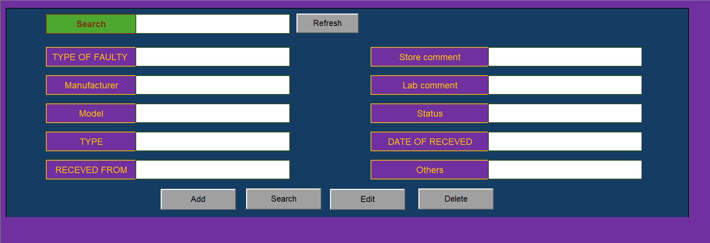
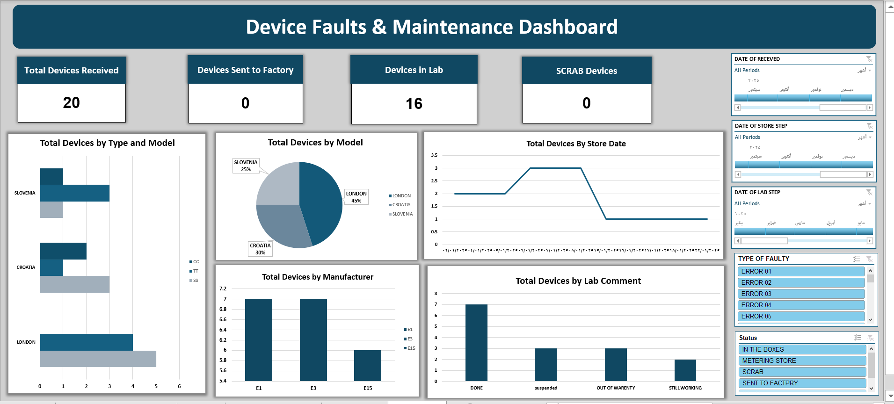
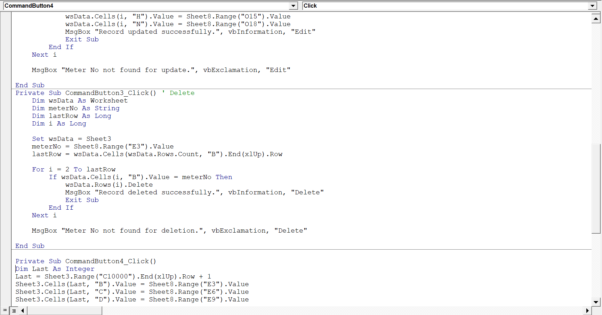

# Excel-Based Case Management System – Smart Interface & Auto Dashboard (Demo)

This repository contains a protected demo of a real freelance project where I built a complete internal system using Microsoft Excel. The system included an interactive data entry form, backend logic, and a fully automated dashboard—all powered by VBA and Excel features.

---

## Overview

This was not just a spreadsheet.  
It was a business tool designed to streamline a critical workflow: tracking returned or faulty items across multiple stages—from store intake to lab processing—while maintaining clarity, structure, and speed.

The goal was to replace manual Excel edits with a guided, controlled interface that saves time, ensures accuracy, and reflects real-time updates across the entire file.

---

## Delivered Solution

- Designed a professional data entry form with dropdowns, search, edit, and delete functions
- Built a protected workflow that restricts user actions to avoid structural damage
- Integrated automatic updates for dashboard and data tables via VBA
- Developed a dashboard that summarizes key case statuses and patterns
- Added flexibility for future updates through modular code design

---

## Key Functionalities

- Interface-style data entry with no direct contact with raw data
- Auto-update mechanisms triggered by:
  - Adding new records
  - Opening the file
  - Manual refresh button (alternative)
- VBA logic includes:
  - Field validation
  - Form button actions (add/edit/delete/search)
  - Pivot table and dashboard refresh handling
- Compatibility with restricted environments where macros or pivot refresh might be limited

---

## About This Demo

This version is locked and limited to protect the privacy of the client and the proprietary logic behind the system.

It contains:
- Sample data with realistic structure
- Visual demonstration of form and dashboard
- Disabled buttons and restricted features
- Hidden backend sheets and protected code

The purpose of this demo is to showcase the depth, structure, and professional packaging of the delivered solution without exposing internal logic or client-specific data.

---

## Why This Project Matters

This system demonstrates the potential of Excel beyond its traditional uses.

It transforms Excel into a self-contained, interactive application that can serve teams and businesses without the need for third-party tools.

For small and medium-sized workflows, this approach brings automation, reliability, and usability—all inside a familiar tool.

It also reflects the developer's ability to:
- Understand business context
- Translate manual processes into scalable logic
- Deliver solutions that go beyond "data entry" and provide real operational value

---

## Structure

---

## Screenshots

### Interface View  

### Dashboard Overview  

### VBA Structure (Visual Only)  

---

## Client Feedback

This was my first paid freelance project.

The client rated the experience 5/5 and acknowledged the level of detail, speed, and honest communication throughout the process.

The solution met all their goals—and delivered more than expected.

---

## Contact

To request a tailored solution or collaborate on Excel-based automation, you can reach me at:

- LinkedIn: [https://www.linkedin.com/in/yousif-ahmed-ibrahim/](https://www.linkedin.com/in/yousif-ahmed-ibrahim/)
- GitHub: [https://github.com/Yousif-Ahmed-Ibrahim](https://github.com/Yousif-Ahmed-Ibrahim)
- Mostaql: [https://mostaql.com/u/Yousif_Ahmed44](https://mostaql.com/u/Yousif_Ahmed44)

---

© 2025 – Yousif Ahmed Ibrahim  
Data Analyst | Excel Workflow Automation | Business-Focused Reporting
